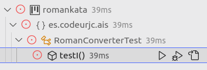

# RomanNumbersKata - Ejemplo de memoria para la práctica de TDD

Nombre de los alumnos: Michel Maes Bermejo e Iván Chicano Capelo

### Ejemplo 1

**INPUT y OUTPUT**: 1 -> "I"

**EJ1. Código de test**
```java
@Test
public void testI() {
    RomanConverter converter = new RomanConverter();
    assertEquals("I", converter.convert(1));
}
```

**EJ1. Captura de que el test NO PASA**



**EJ1. Código mínimo para que el test pase**

```java
public String convert(int number){
    return "I";
}
```

**EJ1. Captura de que el test PASA**


**EJ1. Refactorización**
> [BORRAR]  Solo si se considera necesario

Si queréis justificar vuestra refactorización para añadir un comentario, lo podéis hacer reemplazando este texto.

```java
public String convert(int number){
    return "I"; // Imaginemos que hemos refactorizado aquí
}
```
**EJ1. Captura de que el test PASA tras la refactorización**
> [BORRAR]  Solo si se ha realizado una refactorización

